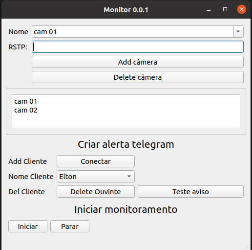

# monitor_cam
monitora status de câmeras ip:

## Como Usar
- 1: criar um bot no telegram salvar seu tokem em um arquivo de texto na raiz como o nome token_bot.txt
- 2: abir a aplicação, cadastrar as os link rstp para monitorar
- 3: conectar com bot, clique em concetar, vá para o telegram e inicie uma conversa com o bot envie /start, volte para aplicação e clique em ok
- 4: clique no botão teste para receber uma mesage de teste.
- 4: inicar o monitoramento. sempre que uma câmera estive offline você será notificado pelo telgram. 

## Dependência
- Opencv
- PySide6
